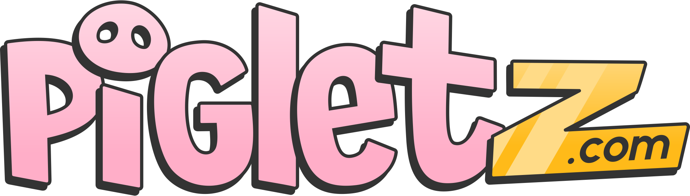
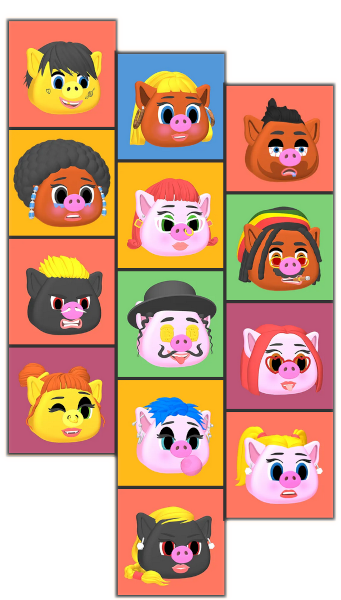
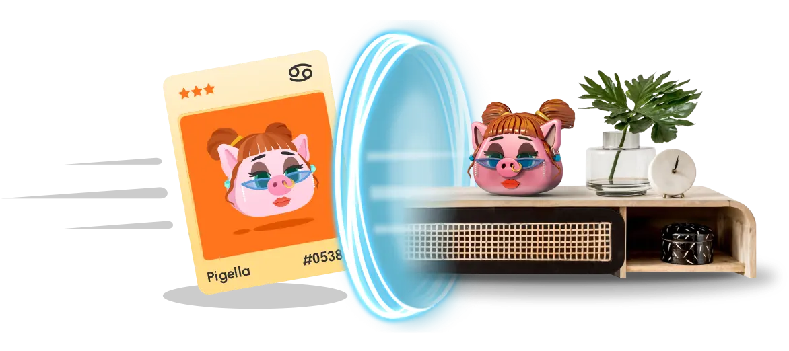
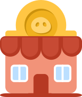

# 🐷 Pigletz

## Overview

Pigletz is a collectible game with DeFi elements. It is built around the main character - the Piglet, an NFT having a utility as a piggy bank where users can deposit crypto tokens and earn PiFi. Pigletz are items. A contemporary version of a piggy bank. An item that can exist in the MetaVerse. And also can exist in the real world. But not in both. Each Piglet starts its life randomly minted and at level 1. Being at level 1 means that only some of its treats are revealed. In order to progress with levels and reveal more traits the owner of the Piglet needs to wait and collect PiFi (similar as eXperience Points). There are options to speed up the collection - for example by completing tasks and activating boosters. Each Piglet has its own wallet - a smart contract that is owned by the Piglet itself. Breaking is the final step in the life of a Piglet. By breaking it the owner is actually killing it, losing its NFT/collectable value, but gaining all the assets within it. One of its unique features is the option to materialize the Piglet. In order to do that the owner stakes the piglet in a specific contract and obtains a real 3D printed Pigletz figure. While being materialized the NFT is locked and cannot be transferred. The only way to unlock it is to break the Pigletz figure (in the real world) and to use the codes inside of it to unlock it. At the end the game is all about the dilemma - which is more valuable - the Piglet as an NFT or the tokens inside of it.

## How it Works



## Key Features

Pigletz is a combination between a NFT, Game, DeFi, MetaVerse and RealWorld elements. Below we will explain how it fits into each segment.&#x20;

### NFT

Pigletz is a collection of ERC721 tokens aka NFTs with the following characteristics:

* 12,345 unique Limited Edition Pigletz with provable random characteristics of various rarity
* 100% hand-crafted 3d models
* A total of over 2 billion combinations possible
* Randomly minted on purchase
* Characteristics get revealed as your Piglet grows
* Additional 5 celebrity NTF's going to charity


[nft.md](pigletz/nft.md)


### Game

Unlike many other NFT projects Pigletz is not only offering beautiful pictures to the users but an entire game experience where the Piglet is the main character.&#x20;

* Level up to reveal Piglet traits and improve base mining rate.
* Collect and apply boosters to increase token production speed even further.
* Monitor and manage your Pigletz through our convenient Dapp


[game.md](pigletz/game.md)


### Tokenomics

Our Pigletz produce their own token called PiFi. PiFi tokens are used for leveling up the piglet, in the DeFi services as well as to order the physicall piglet. In the future PiFi will be part also in our MetaVerse.


[tokenomics.md](pigletz/tokenomics.md)


### Real World

Pigletz is the first project introducing a protocol where an NFT can jump between the MetaVerse and the Real World. We call this Materialization. Reverse process is also possible and we call it Digitalization.&#x20;


[materialization.md](pigletz/materialization.md)


### DeFi

Pigletz has a utility as a Piggy Bank. It also mints its own token. We have designed additional DeFi services which can be used within the Pigletz ecosystem.


[defi.md](pigletz/defi.md)


### MetaVerse

We work on creating a new kind of a world acting as a bridge between the MetaVerse and the Real World.&#x20;


[metaverse.md](pigletz/metaverse.md)


## Contacts


Web



Discord



Telegram



Twitter


© 2021-2022 Pigletz
