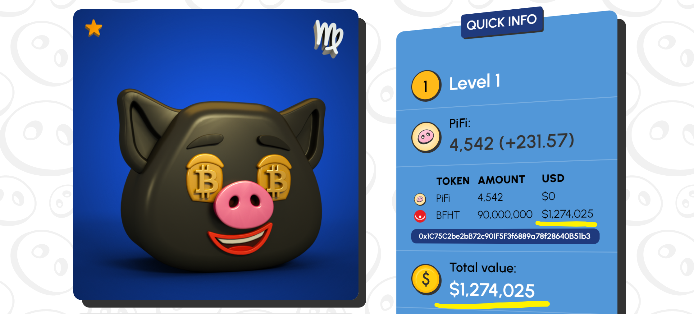
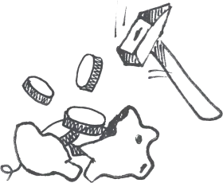

# DeFi

## Piggy Bank

As we mentioned earlier our Pigletz are more than just a picture or NFT. They have utilities. The most important one is that they are actually a digital piggy banks. That means they can hold crypto tokens inside of their smart contract.&#x20;

#### Hoe does this work?

Each piglet has its own wallet. The wallet can receive and send tokens. The control over this wallet is delegated to the smart contract of the piglet. That means no human can have direct access to this wallet. In order to deposit crypto tokens into the piglet its owner has two choices:

* **Deposit** - this is a method in the smart contract allowing a crypto token, specified by its address to be deposited into the piglet. The token needs to be listed in [PancakeSwap](https://pancakeswap.finance). The contract will automatically evaluate its USD value and will add it to the piglet.
* **Direct Transfer** - user can send tokens directly to the wallet address of piglet. However this doesn't automatically register the token in the piglet. In order to register it its owner needs to call the register method providing the token address.&#x20;

The valuation of the Piglet is based on the sum of the total evaluation of all deposited tokens.


There is a limitation of the different tokens types that can be deposited into a single piglet. The limit is 9 tokens, including PiFi.&#x20;


Once deposited the tokens stay inside the piglet and cannot be withdrawn or used. The only way to withdraw the tokens is to break (burn) the piglet. Doing that you will lose its NFT value but will acquire all the tokens inside it, including PiFi.&#x20;

#### Breaking

In order to break the piglet its owner needs to call its burn method. The caller address will automatically receive all tokens belonging to the piglet's wallet.

## Staking

It allows Pigletz to be staked into the staking contract for a specified period. During that period a special booster with 50% boost will be activated. After unstaking the booster will be deactivated.&#x20;

While staked the Pigletz will be out of the market, locked into the contract so no one can transfer them or break them. However they will continue to produce PiFi tokens.

## Lending

Lending allows Pigletz owners to use their piglet as a collateral and to lend PiFi tokens.&#x20;

This works in the following way:

1. First we evaluate all tokens inside the piglets using their BUSD value in PancakeSwap.
2. The total value of the loan cannot exceed <mark style="color:yellow;">80%</mark> of the total piglet evaluation. The percentage is not fixed yet.&#x20;
3. The user chooses amount and a period.
4. The PiFi for the loan comes from Liquidity Providers.&#x20;
5. The user is obliged to return the PiFi loan with interest within the specified period.&#x20;
6. In a case the user returns the correct PiFi amount the piglet locked into the Lending Contract is transferred back to the user.
7. Otherwise if the PiFis are not returned within the predefined period the Piglet is broken automatically by the contract and all the tokens within it are swapped in PancakeSwap for PiFi tokens which are later distributed as rewards to the Liquidity Providers.
