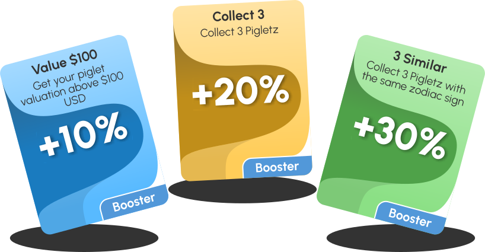

# Game

Pigletz features gamification elements.

## Levels

Each piglet starts his life in Level 1. There only some traits are visible - gender, body, eyes, mouth, zodiac, background ([see NFT](nft.md)). In order to reveal more of his traits the piglet needs to level up.&#x20;

To level up the piglet needs to collect (mint) enough PiFi tokens. PiFi tokens are generated every 24 hours. The amount of the generated PiFi tokens depends on the level of the piglet and the activated boosters.&#x20;

The following table shows the PiFi required for each level:

<table><thead><tr><th data-type="number">Level</th><th data-type="number">Base Minting (24h)</th><th data-type="number">PiFi To Next Level</th><th>Months </th></tr></thead><tbody><tr><td>1</td><td>167</td><td>0</td><td></td></tr><tr><td>2</td><td>250</td><td>10000</td><td>2</td></tr><tr><td>3</td><td>417</td><td>55000</td><td>6</td></tr><tr><td>4</td><td>500</td><td>null</td><td></td></tr></tbody></table>

## Boosters

Boosters increase the amount of PiFi tokens minted by a Piglet daily. In order to be activated the booster requires some task to be completed.&#x20;

<table><thead><tr><th>Booster</th><th data-type="number">Level</th><th>Boost</th><th>Requirement</th></tr></thead><tbody><tr><td><strong>Value $100</strong></td><td>1</td><td>10%</td><td>Invest tokens and make your piglet with at least $100 valuation</td></tr><tr><td><strong>Invest 3 Tokens</strong></td><td>1</td><td>10%</td><td>Invest 3 different tokens</td></tr><tr><td><strong>Collect 3</strong></td><td>1</td><td>20%</td><td>Collect 3 Pigletz</td></tr><tr><td><strong>3 Similar</strong></td><td>1</td><td>30%</td><td>Collect 3 with the same zodiac sign</td></tr><tr><td><strong>Staked</strong></td><td>1</td><td>50%</td><td>Stake it in the Staking Contract</td></tr><tr><td><strong>Special</strong></td><td>1</td><td>50%</td><td>It is born like this</td></tr><tr><td><strong>Invest $500</strong></td><td>2</td><td>30%</td><td>Invest tokens and make your piglet with at least $500 valuation</td></tr><tr><td><strong>Collect 7</strong></td><td>2</td><td>30%</td><td>Collect 7 piglets</td></tr><tr><td><strong>Invest $2000</strong></td><td>3</td><td>100%</td><td>Invest tokens and make your piglet with at least $2000 valuation</td></tr><tr><td><strong>Invest 7 tokens</strong></td><td>3</td><td>20%</td><td>Invest 7 different tokens</td></tr><tr><td><strong>12 Different</strong></td><td>3</td><td>80%</td><td>Collect 12 piglets with different zodiac signs</td></tr></tbody></table>

The maximum boost possible is **430%**
