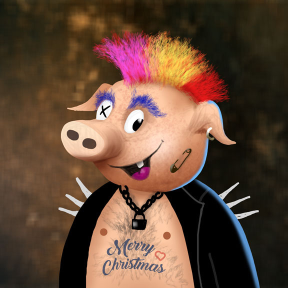

# NFT

## The Piglet

The Piglet is as an NFT is a high quality render of a 3D model. Each model has different traits. The traits are combined with different probability in order to produce 12,345 unique 3D Pigletz.&#x20;

## The Traits

All traits are divided into the following categories:

* <mark style="color:blue;">**Gender**</mark> - we have Male and Female Pigletz and all the traits below are different for each gender. However we also have Other gender which can mix between Male and Female traits.&#x20;
* <mark style="color:blue;">**Body**</mark> - there are 12 different body types such as Pink, Gold, Stone, ....
* <mark style="color:blue;">**Mouth**</mark> - we have 16 mouths such as Smiling, Smoking Cigar, ...
* <mark style="color:blue;">**Eyes**</mark> - 16 types such as Blue, Crying, Bitcoin etc.
* <mark style="color:red;">**Hairstyle**</mark> - 25 different hairstyles exists. Female Pigletz have more.&#x20;
* <mark style="color:red;">**Beard style**</mark> - Only Male Pigletz has beard styles, totally 6 variants.
* <mark style="color:green;">**Earrings**</mark> - totally 10
* <mark style="color:green;">**Nose Piercing**</mark> - 6 styles
* <mark style="color:green;">**Glasses**</mark> - we have 11 (sun)glasses options
* <mark style="color:green;">**Tattoo**</mark> - 7 options

Not all traits are visible from the beginning (birth of the Piglet).&#x20;

<mark style="color:blue;">**Blue**</mark> traits are visible on level 1

<mark style="color:red;">**Red**</mark> are revealed on level 2

Finally on level 3 the <mark style="color:green;">**Green**</mark> are shown and this completes the look of the Piglet.


### Additional Traits

There are also some additional traits such as:

* **Background** - There are 6 different backgrounds - Blue, Green, Orange, Purple, Red, Yellow
* **Zodiac Signs** - following the Western Zodiac they are: Aries, Taurus, Gemini, Cancer, Leo, Virgo, Libra, Scorpio, Sagittarius, Capricorn, Aquarius, Pisces

## Production

We followed a long path until we finally achieved the Pigletz we all love.&#x20;

We started with concept art from different artists

.jpg>)   

And more ...

   

...

Next we created 3D models, objects, meshes for all the categories and traits


Cinema 4D Modelling



Cinema 4D Rendering


We developed a generator which we used to produce 12,345 different trait combinations based on a rarity table and randomness. For the random function we used the magic seed: 1638504306 which is the Unix Epoch representation of the data December 3, 2021 4:05:06 AM or 12/3/4:5:6.

```python
"""
Main
"""
from pathlib import Path
import time
import click
from pigletz.discounts_generator import PigletzDiscountsGenerator
from pigletz.generator import PigletGenerator
from pigletz.image_optimizer import ImageOptimizer
from pigletz.post_processing import PigletPostProcessing


@click.group()
def cli() -> None:
    """
    Pigletz traits generator. (c) 2021 by Pigletz.com 
    """


@click.command()
@click.argument("inputfile", required=True)
@click.option("--limit", default=12345, type=int, help="How many piglets to generate")
@click.option("--seed", default=1638504306, type=int, help="Seed for the RNG")
@click.option("--out", help="Output json file")
def generate(inputfile: str, out: str, limit: int, seed: int):
    """ Generates json file with traits """

    generator = PigletGenerator.from_json(inputfile, limit, seed)
    data = generator.generate()
    generator.save_to_file(out, data)

```

Next we wrote a plugin for Cinema 4D that helped us to render all 12,345 different Pigletz.

```python
if __name__ == "__main__":

    filename = c4d.storage.LoadDialog(
        title="Load piglets JSON file", type=c4d.FILESELECTTYPE_ANYTHING, flags=c4d.FILESELECT_LOAD)
    with open(filename, "rb") as file:
        data = json.load(file)

    piglets = list(data["population"].keys())
    piglets.sort()

    start = int(gui.InputDialog(
        "Start from (0-{limit})?".format(limit=len(piglets)-2), "0"))
    end = int(gui.InputDialog(
        "Ending to (1-{limit})?".format(limit=len(piglets)-1), str(len(piglets)-1)))

    processPiglets(piglets[start:end], start, end)

```

Finally we used a rendering farm that rendered 12,345 Pigletz in each 4 variations (for each level). This took about 10 days.&#x20;

After that we post processed all renders to achieve the final result:


## ERC721

NFT or Non Fungible Token is a token living in the blockchain, described by s Smart Contract following the [ERC721 standard](https://eips.ethereum.org/EIPS/eip-721).&#x20;

Each NFT has usually two parts:

* Blockchain part - smart contract, describing the NFT as ERC721 token with a limited supply, allowing minting and transfers of the tokens etc.
* Meta Data - text information combined with media data that is the actual representation of the NFT, the one the user sees/hears/... .

Pigletz resides at the moment in the [Binance Smart Chain blokchain](https://openzeppelin.com/contracts/). Its contract can be found at the following address: [0xbF84076b06a100d38ce562733098eDc0eDa4D7f7](https://bscscan.com/address/0xbf84076b06a100d38ce562733098edc0eda4d7f7#code)

The contract utilizes the [OpenZeppelin ](https://openzeppelin.com/contracts/)framework which is a de facto standard for EVM compatible blockchains.

The meta data if the Pigletz is uploaded to the [IPFS](https://ipfs.io) which gives higher level of decentralization and security to our users. For example the first minted piglet #4041 can be found here: [https://ipfs.io/ipfs/QmZ88agv3zymNctxFtraparboWZ8o2jSxV6T6XnFThYVBJ](https://ipfs.io/ipfs/QmZ88agv3zymNctxFtraparboWZ8o2jSxV6T6XnFThYVBJ)


